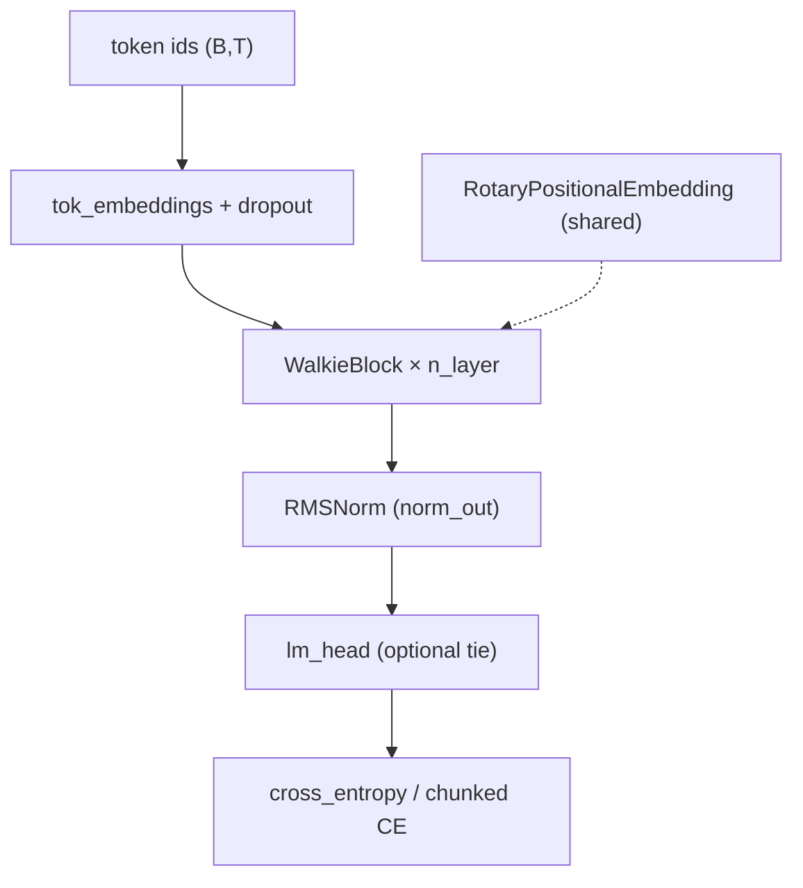
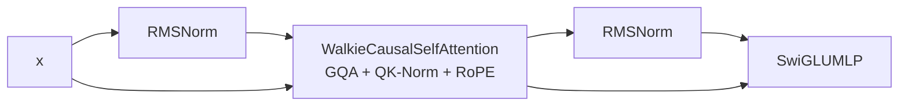

# Walkie 预训练 Playbook

本文档系统梳理 **Walkie-Code** 系列模型的架构与预训练流水线，所有关键符号均附带可点击的源码链接（相对路径 + 行号，在 GitHub / VS Code / Cursor 中均可跳转）。

> **范围说明**：本仓库已实现的是 **因果语言建模（CLM）两阶段 WSD 预训练**；[`Walkie-Code-1B.md`](../Walkie-Code-1B.md) 中的 FIM、16K 上下文课程、GRPO 等属于产品路线图，**尚未接入** [`walkie_pretrain.py`](../train/walkie_pretrain.py)（配置里仅预留 `special_tokens` 元数据）。

---

## 目录

1. [代码地图](#1-代码地图)
2. [模型架构总览](#2-模型架构总览)
3. [配置与规模变体](#3-配置与规模变体)
4. [前向传播与损失](#4-前向传播与损失)
5. [预训练入口与运行方式](#5-预训练入口与运行方式)
6. [数据流水线](#6-数据流水线)
7. [两阶段 WSD 与数据切换](#7-两阶段-wsd-与数据切换)
8. [优化器：AdamW + Muon](#8-优化器adamw--muon)
9. [训练循环细节](#9-训练循环细节)
10. [Checkpoint 与恢复](#10-checkpoint-与恢复)
11. [分布式与性能开关](#11-分布式与性能开关)
12. [与路线图差异](#12-与路线图差异)
13. [快速检查清单](#13-快速检查清单)

---

## 1. 代码地图

| 模块 | 文件 | 核心类型 / 函数 |
|------|------|-----------------|
| 模型主体 | [`core/model/walkie.py`](../core/model/walkie.py) | [`WalkieConfig`](../core/model/walkie.py#L34-L74)、[`WalkieBlock`](../core/model/walkie.py#L77-L109)、[`WalkieForCausalLM`](../core/model/walkie.py#L112-L272) |
| 注意力 | [`core/attention/walkie_attention.py`](../core/attention/walkie_attention.py) | [`WalkieCausalSelfAttention`](../core/attention/walkie_attention.py#L45-L163)、[`repeat_kv`](../core/attention/walkie_attention.py#L34-L42) |
| FFN | [`core/ffn/swiglu.py`](../core/ffn/swiglu.py) | [`SwiGLUMLP`](../core/ffn/swiglu.py#L19-L45) |
| 归一化 | [`core/norm/rmsnorm.py`](../core/norm/rmsnorm.py) | [`RMSNorm`](../core/norm/rmsnorm.py#L16-L36) |
| 位置编码 | [`core/position/rope.py`](../core/position/rope.py) | [`RotaryPositionalEmbedding`](../core/position/rope.py#L53-L103)、[`apply_rope`](../core/position/rope.py#L32-L50) |
| 预训练入口 | [`train/walkie_pretrain.py`](../train/walkie_pretrain.py) | [`train`](../train/walkie_pretrain.py#L559-L1125)、[`ShuffledBlockSampler`](../train/walkie_pretrain.py#L174-L296) |
| 学习率 | [`core/utils/walkie_schedule.py`](../core/utils/walkie_schedule.py) | [`WalkieWSDSchedule`](../core/utils/walkie_schedule.py#L31-L163) |
| 优化器 | [`core/utils/walkie_optim.py`](../core/utils/walkie_optim.py) | [`Muon`](../core/utils/walkie_optim.py#L54-L127)、[`build_walkie_optimizers`](../core/utils/walkie_optim.py#L167-L202) |
| Checkpoint | [`core/utils/walkie_checkpoint.py`](../core/utils/walkie_checkpoint.py) | [`save_walkie_checkpoint`](../core/utils/walkie_checkpoint.py#L81-L136)、[`apply_walkie_checkpoint`](../core/utils/walkie_checkpoint.py#L179-L207) |
| 数据编码 | [`scripts/encode_walkie.py`](../scripts/encode_walkie.py) | 将语料写成 `main.bin` / `anneal.bin` |
| 模型配置 | [`configs/model/`](../configs/model/) | `walkie_tiny.yaml`、`walkie_code_0.5b.yaml`、`walkie_code_1b.yaml` |
| 训练配置 | [`configs/train/`](../configs/train/) | `pretrain_walkie_tiny.yaml`、`pretrain_walkie.yaml` |

**测试入口**（冒烟 / 回归）：

- [`tests/test_walkie_model.py`](../tests/test_walkie_model.py) — 模型前向与 shape
- [`tests/test_walkie_training_smoke.py`](../tests/test_walkie_training_smoke.py) — 调用 [`train()`](../train/walkie_pretrain.py#L559) 跑 tiny 配置
- [`tests/test_walkie_schedule.py`](../tests/test_walkie_schedule.py)、[`tests/test_walkie_optim.py`](../tests/test_walkie_optim.py)、[`tests/test_walkie_checkpoint.py`](../tests/test_walkie_checkpoint.py)

---

## 2. 模型架构总览

Walkie 是面向 **代码** 的 Decoder-only Transformer，相对本仓库 GPT-2 教学实现的主要差异写在 [`walkie.py` 文件头](../core/model/walkie.py#L1-L9)：

| 设计选择 | 实现位置 | 说明 |
|----------|----------|------|
| Pre-norm + 残差 | [`WalkieBlock.forward`](../core/model/walkie.py#L106-L109) | `x = x + Attn(RMSNorm(x))`，再 `x = x + SwiGLU(RMSNorm(x))` |
| RMSNorm | [`RMSNorm`](../core/norm/rmsnorm.py#L16-L36) | 无均值中心化，仅可学习 scale |
| SwiGLU FFN | [`SwiGLUMLP`](../core/ffn/swiglu.py#L42-L45) | `silu(gate) * up` 再 `down` 投影 |
| GQA + QK-Norm + RoPE | [`WalkieCausalSelfAttention`](../core/attention/walkie_attention.py#L45-L163) | 24Q/8KV（1B 默认），Q/K 各做 RMSNorm，RoPE 只作用于 Q/K |
| 无 bias | 各 `nn.Linear(..., bias=False)` | 与 [`WalkieConfig.bias`](../core/model/walkie.py#L58) 一致 |
| Weight tying | [`WalkieForCausalLM.__init__`](../core/model/walkie.py#L139-L140) | 默认 `tie_weights=True`，`lm_head.weight` 与 `tok_embeddings.weight` 共享 |
| 共享 RoPE 表 | [`WalkieForCausalLM`](../core/model/walkie.py#L125-L134) | 全层共用一个 [`RotaryPositionalEmbedding`](../core/position/rope.py#L53)，避免每层重复缓存 cos/sin |

### 2.1 结构示意图（数据流）



单层 [`WalkieBlock`](../core/model/walkie.py#L77-L109) 展开：



### 2.2 注意力：GQA + QK-Norm + RoPE

实现见 [`WalkieCausalSelfAttention.forward`](../core/attention/walkie_attention.py#L108-L163)：

1. **投影**：`q_proj` → `(B, n_head, T, head_dim)`；`k_proj` / `v_proj` → `(B, n_head_kv, T, head_dim)`。
2. **QK-Norm**（可选）：对每头最后一维做 [`RMSNorm`](../core/norm/rmsnorm.py#L30-L36)，[`q_norm` / `k_norm`](../core/attention/walkie_attention.py#L90-L96)。
3. **RoPE**：[`self.rope(T, ...)`](../core/attention/walkie_attention.py#L119) 取 cos/sin，[`apply_rope`](../core/position/rope.py#L32-L50) 旋转 Q/K（**不**加在 token embedding 上）。
4. **注意力内核**（`attn_impl`）：
   - [`flash_attn2`](../core/attention/walkie_attention.py#L123-L136)：需 CUDA + fp16/bf16，走 `flash_attn_func`。
   - [`sdpa`](../core/attention/walkie_attention.py#L137-L147)：默认；先用 [`repeat_kv`](../core/attention/walkie_attention.py#L34-L42) 把 KV 头复制到与 Q 头数一致，再 `scaled_dot_product_attention(..., is_causal=True)`。
   - [`eager`](../core/attention/walkie_attention.py#L148-L157)：显式因果 mask，用于对齐/教学。
5. **输出**：`o_proj` + `resid_dropout`。

GQA 比例：`n_rep = n_head // n_head_kv`（例如 1B：24/8 = 3）。

### 2.3 初始化策略

- 通用线性/Embedding：[`_init_weights`](../core/model/walkie.py#L150-L157)，`N(0, init_std)`。
- 残差支路输出矩阵（`o_proj`、`down_proj`）：额外除以 `sqrt(2 * n_layer)`，见 [`WalkieForCausalLM.__init__`](../core/model/walkie.py#L143-L148)（与 GPT-2 深度缩放一致）。
- 0.5B 配置将 [`init_std`](../configs/model/walkie_code_0.5b.yaml#L32) 设为 `0.02 / sqrt(2*n_layer)` 的显式值。

### 2.4 生成（推理）

[`WalkieForCausalLM.generate`](../core/model/walkie.py#L229-L272) 提供 temperature / top-k / top-p / eos；**当前无 KV cache**，每步对全长序列重算（文件注释写明首版行为）。

---

## 3. 配置与规模变体

[`WalkieConfig`](../core/model/walkie.py#L34-L74) 是 dataclass，通过 [`from_dict`](../core/model/walkie.py#L68-L71) / [`to_dict`](../core/model/walkie.py#L73-L74) 与 YAML 互转。

| 变体 | 配置文件 | 约参数量 | 典型 `block_size` | `n_layer` | `n_embd` | GQA |
|------|----------|----------|-------------------|-----------|----------|-----|
| Tiny（冒烟） | [`walkie_tiny.yaml`](../configs/model/walkie_tiny.yaml) | ~0.33M | 128 | 2 | 128 | 4Q / 2KV |
| Code-0.5B | [`walkie_code_0.5b.yaml`](../configs/model/walkie_code_0.5b.yaml) | ~501M | 4096 | 24 | 1280 | 20Q / 5KV |
| Code-1B | [`walkie_code_1b.yaml`](../configs/model/walkie_code_1b.yaml) | ~964M | 2048（配置） | 36 | 1536 | 24Q / 8KV |

参数量由 [`WalkieForCausalLM.num_parameters`](../core/model/walkie.py#L189-L192) 统计；`tie_weights=True` 时 tied 权重在 `parameters()` 中只计一次。

**与 [`Walkie-Code-1B.md`](../Walkie-Code-1B.md) 计划书的差异**（实现已落地 vs 计划）：

| 字段 | 当前代码默认 | 计划书 v2 |
|------|-------------|-----------|
| `n_layer`（1B） | 36 | 48 |
| `d_ffn`（1B） | 3840 | 4096 |
| `tie_weights` | `true` | 独立 output embedding |
| `block_size`（1B 配置） | 2048 | 16384 训练目标 |
| FIM / repo tokens | 仅 `special_tokens` 字典 | 50% FIM 率 |

训练时 **`block_size` 以 `train.block_size` 为准**（会 [`setdefault` 写入 model cfg](../train/walkie_pretrain.py#L593-L596)），可与模型 YAML 中的 `block_size` 不同。

---

## 4. 前向传播与损失

### 4.1 训练前向

[`WalkieForCausalLM.forward`](../core/model/walkie.py#L195-L226)：

```text
idx (B,T) → Embedding → Dropout → [可选 gradient_checkpoint 的] N × WalkieBlock → norm_out → lm_head → CE
```

- `targets is None`：只算最后一步 logits（推理省显存）。
- `targets` 给定且 `return_logits=False`：走分块 CE，不物化全长 logits（训练省显存）。

### 4.2 分块交叉熵

[`_chunked_cross_entropy`](../core/model/walkie.py#L159-L186) 按 [`loss_chunk_size`](../core/model/walkie.py#L63)（默认 1024；0.5B 配置为 256）沿序列维切分，对每块单独 `lm_head` + `cross_entropy(..., reduction="sum")`，最后用非 `ignore_index` token 数归一化。`ignore_index=-1` 可屏蔽 padding（数据侧需自行写入 -1，当前 memmap 流水线未使用）。

### 4.3 Gradient Checkpointing

当 [`gradient_checkpointing`](../core/model/walkie.py#L62) 为真且 `model.training`，每层用 [`torch.utils.checkpoint.checkpoint`](../core/model/walkie.py#L207-L209)（`use_reentrant=False`）。在 [`pretrain_walkie.yaml`](../configs/train/pretrain_walkie.yaml#L67) 中默认开启。

---

## 5. 预训练入口与运行方式

入口：[`train/walkie_pretrain.py`](../train/walkie_pretrain.py)（**独立实现**，不修改 [`train/pretrain.py`](../train/pretrain.py)）。

| 场景 | 命令 |
|------|------|
| 单卡冒烟 | `python -m train.walkie_pretrain --config configs/train/pretrain_walkie_tiny.yaml` |
| 多卡 DDP | `torchrun --nproc_per_node=N -m train.walkie_pretrain --config configs/train/pretrain_walkie.yaml` |
| 恢复训练 | 加 `--resume runs/walkie_code_0.5b` 或指向 `latest.pt` |
| 仅加载权重 | `--init-from path/to/ckpt.pt`（不恢复优化器/调度器） |
| 覆盖配置 | 尾部 OmegaConf dotlist，如 `train.batch_size=8 train.total_steps=100` |

CLI 解析：[`parse_args`](../train/walkie_pretrain.py#L79-L95) → [`main`](../train/walkie_pretrain.py#L1128-L1139) → [`load_config`](../core/utils/config.py) → [`train(cfg)`](../train/walkie_pretrain.py#L559)。

[`train()`](../train/walkie_pretrain.py#L559) 主流程分段：

1. [`setup_distributed`](../train/walkie_pretrain.py#L566) — DDP 初始化  
2. 构建 [`WalkieForCausalLM`](../train/walkie_pretrain.py#L596-L613) — 可选 DDP → 可选 `torch.compile`  
3. [`build_walkie_optimizers`](../train/walkie_pretrain.py#L625-L636) + [`WalkieWSDSchedule.from_config`](../train/walkie_pretrain.py#L638-L653)  
4. [`resume` / `init_from`](../train/walkie_pretrain.py#L661-L692)  
5. 加载两阶段 memmap 数据 [`_load_stage_data`](../train/walkie_pretrain.py#L696-L721)  
6. 训练循环 [`for step in range(...)`](../train/walkie_pretrain.py#L853)  
7. [`cleanup_distributed`](../train/walkie_pretrain.py#L1125)

---

## 6. 数据流水线

### 6.1 训练期：memmap token bin

配置结构（[`pretrain_walkie.yaml`](../configs/train/pretrain_walkie.yaml#L5-L14)）：

```yaml
data:
  stages:
    main:
      bin: <path>      # 主阶段训练 token 流
      val_bin: <path>  # 可选；缺失则回退到 bin
      dtype: uint16    # 65536 词表可用 uint16
    anneal:
      bin: ...
      val_bin: ...
      dtype: uint16
```

加载逻辑 [`_load_stage_data`](../train/walkie_pretrain.py#L112-L138)：

- 路径存在 → `np.memmap(..., mode="r")`，且长度须 `> block_size`。
- 路径缺失 → **随机 token 兜底**（仅 smoke）；主训练前务必填入真实 `bin`。

### 6.2 Batch 构造

**随机采样**（`train.sampling.mode: random`）：

- [`get_batch`](../train/walkie_pretrain.py#L158-L171)：在 `[0, len(data)-block_size)` 均匀随机起点，取连续 `block_size` 个 token 为 `x`，偏移 +1 为 `y`（标准 CLM）。

**默认：打乱后顺序遍历**（`shuffled_sequential`）：

- [`ShuffledBlockSampler`](../train/walkie_pretrain.py#L174-L296)：把语料切成 `num_samples = (len-1)//block_size` 个不重叠块起点，`shuffle` 后按 **global batch** 无放回推进；DDP 下每 rank 取 `cursor + rank*batch_size` 的一段索引（[`next_starts`](../train/walkie_pretrain.py#L232-L238)）。
- 一个 epoch 扫完后 `epoch++` 并重新 shuffle（[`_reshuffle`](../train/walkie_pretrain.py#L220-L223)）。

实际取 token：[`_batch_from_starts`](../train/walkie_pretrain.py#L141-L155)。

### 6.3 离线编码

[`scripts/encode_walkie.py`](../scripts/encode_walkie.py) 从 Parquet / JSON 任务列表读取文本，用 Walkie tokenizer 编码，写出：

- `main.bin` / `anneal.bin`
- 可选 `main_val.bin` / `anneal_val.bin`（按 `main-val-ratio`、`anneal-val-ratio` 划分）

详见脚本 [`parse_args`](../scripts/encode_walkie.py#L47-L80) 与实验 Notebook [`docs/experiments/03_walkie_data.ipynb`](../docs/experiments/03_walkie_data.ipynb)。

### 6.4 dtype 校验

[`_validate_token_dtype`](../train/walkie_pretrain.py#L101-L109) 确保整数 dtype 能表示 `vocab_size - 1`。

---

## 7. 两阶段 WSD 与数据切换

Walkie 预训练用 **单一全局 step 计数器**，在 [`anneal_start_ratio`](../core/utils/walkie_schedule.py#L74-L76) 处切换 **数据流**，学习率 **连续、无跳变**（设计说明见 [`walkie_schedule.py` 文件头](../core/utils/walkie_schedule.py#L1-L16)）。

### 7.1 阶段划分

| 阶段名 | step 范围 | 训练数据 | 验证数据 |
|--------|-----------|----------|----------|
| `main` | `[0, anneal_start)` | `data.stages.main.bin` | `main.val_bin` 或回退 `main.bin` |
| `anneal` | `[anneal_start, total_steps]` | `data.stages.anneal.bin` | `anneal.val_bin` 或回退 |

[`schedule.current_stage(step)`](../core/utils/walkie_schedule.py#L78-L79) 在训练循环中驱动切换（[`walkie_pretrain.py`](../train/walkie_pretrain.py#L858-L868)）。

`anneal_start = int(total_steps * anneal_start_ratio)`。例如 [`pretrain_walkie.yaml`](../configs/train/pretrain_walkie.yaml#L30-L31)：`0.89 × 16707 ≈ 14869` 步进入 anneal。

### 7.2 学习率轨迹（WSD）

对每个优化器 track（`adamw` / `muon`）独立 [`peak_lr` / `final_lr`](../core/utils/walkie_schedule.py#L26-L28)，共享同一 **形状因子** [`_shape_factor`](../core/utils/walkie_schedule.py#L81-L99)：

```text
warmup:  step ∈ [0, warmup_steps)     → lr = peak * (step / warmup_steps)
stable:  step ∈ [warmup_steps, anneal_start) → lr = peak
decay:   step ∈ [anneal_start, total_steps]  → lr = final + (peak - final) * f(progress)
```

`f(progress)` 由 [`decay_shape`](../core/utils/walkie_schedule.py#L94-L99) 决定：

- `sqrt`：`sqrt(1 - progress)`（默认，配置与 ICLR 2025 FG-WSD 建议一致）
- `linear`：`1 - progress`
- `cosine`：余弦衰减

关键性质：在 `step == anneal_start` 时 `progress=0` → `f=1` → **lr 仍等于 peak**，因此切换 anneal 数据时 LR 不会突变。

每步：[`schedule.step_to(step)`](../core/utils/walkie_schedule.py#L114-L117) → [`apply_lrs_to_optimizers`](../core/utils/walkie_schedule.py#L154-L163)。

### 7.3 与 token 预算对齐（0.5B 示例）

[`pretrain_walkie.yaml`](../configs/train/pretrain_walkie.yaml#L27-L32) 注释给出推算：

```text
tokens_per_step = batch_size × block_size × grad_accum_steps × world_size
                = 16 × 4096 × 16 × 2 = 1,048,576  (双卡示例)

total_steps = (main_tokens + anneal_tokens) / tokens_per_step
```

需自行保证 `main.bin` / `anneal.bin` 的 token 总量与 `total_steps`、`anneal_start_ratio` 一致。

---

## 8. 优化器：AdamW + Muon

实现：[`core/utils/walkie_optim.py`](../core/utils/walkie_optim.py)。

### 8.1 参数分组

[`split_walkie_params`](../core/utils/walkie_optim.py#L146-L164) / [`_is_muon_param`](../core/utils/walkie_optim.py#L133-L143)：

| 优化器 | 托管参数 | 排除 |
|--------|----------|------|
| **AdamW** | 1D、Embedding、`lm_head`、所有含 `norm` 的权重 | — |
| **Muon** | 2D 矩阵：`q/k/v/o_proj`、`gate/up/down_proj` 等 | `embed`、`lm_head`、`norm` |

Tied embedding 通过 `id(p)` 去重，避免同一权重进入两组（[`split_walkie_params`](../core/utils/walkie_optim.py#L151-L157)）。

### 8.2 Muon 更新

[`Muon.step`](../core/utils/walkie_optim.py#L86-L127)：

1. Heavy-ball / Nesterov 动量得到 `update`。
2. [`zeropower_via_newton_schulz5`](../core/utils/walkie_optim.py#L26-L48) 把 `update` 投影到近似正交方向（5 步 NS，系数来自 Keller Jordan Muon 实现）。
3. 按 `scale = max(1, sqrt(fan_out/fan_in))` 缩放步长后 `p.add_(ortho, alpha=-lr * scale)`。
4. 可选 decoupled weight decay：`p.mul_(1 - lr * wd)`。

### 8.3 典型超参（0.5B 训练配置）

见 [`pretrain_walkie.yaml`](../configs/train/pretrain_walkie.yaml#L42-L58)：

| | AdamW | Muon |
|---|-------|------|
| peak_lr | 2.5e-4 | 0.015 |
| final_lr | 2.5e-5 | 0.0015 |
| 其它 | β=(0.9,0.95), wd=0.1 | momentum=0.95, nesterov, ns_steps=5, wd=0 |

---

## 9. 训练循环细节

主循环：[`walkie_pretrain.py` L853–1075](../train/walkie_pretrain.py#L853-L1075)。

### 9.1 单 step 时间线

对每个 `step`（从 `start_step` 到 `total_steps`，**含** 末尾 eval/ckpt 的 `total_steps` 迭代）：

1. **设 LR**：`lrs = schedule.step_to(step)`（[`L855-L856`](../train/walkie_pretrain.py#L855-L856)）
2. **阶段日志**：`stage` 变化时打印（[`L858-L865`](../train/walkie_pretrain.py#L858-L865)）
3. **Eval**（`step % eval_interval == 0` 且 `step > start_step`）：[`get_batch`](../train/walkie_pretrain.py#L876-L889) 在 **当前阶段** 的 val 上估 loss，DDP `all_reduce` 均值；更优则写 [`best.pt`](../train/walkie_pretrain.py#L907-L920)
4. **Checkpoint**（`step % ckpt_interval == 0`）：写 [`latest.pt`](../train/walkie_pretrain.py#L940-L953)，可选 [`step_XXXXXXXX.pt`](../train/walkie_pretrain.py#L954-L970) + [`prune_step_checkpoints`](../core/utils/walkie_checkpoint.py#L228-L245)
5. **训练 micro-batches**（`grad_accum_steps` 次）：
   - 取 batch：sampler 或 `get_batch`（[`L983-L993`](../train/walkie_pretrain.py#L983-L993)）
   - DDP：前 `grad_accum-1` 步 [`model.no_sync()`](../train/walkie_pretrain.py#L994-L998)
   - 前向 `model(x, y, return_logits=False)`（[`L1000-L1008`](../train/walkie_pretrain.py#L1000-L1008)）
   - 梯度累积 + 可选 [`grad_clip`](../train/walkie_pretrain.py#L1012-L1018)
   - AMP fp16：`GradScaler`（[`L655`](../train/walkie_pretrain.py#L655)、[`L1020-L1026`](../train/walkie_pretrain.py#L1020-L1026)）
6. **日志**（`completed_step % log_interval`）：loss、双 LR、tok/s、ETA、峰值显存；可选 SwanLab（[`L1058-L1075`](../train/walkie_pretrain.py#L1058-L1075)）

注意：循环在 `step == total_steps` 时 `break`（[`L973-L974`](../train/walkie_pretrain.py#L973-L974)），最后一步训练更新发生在 `step == total_steps - 1` 的迭代内；收尾再写一次 `latest.pt`（[`L1077-L1110`](../train/walkie_pretrain.py#L1077-L1110)）。

### 9.2 Sampler 恢复策略

[`train.sampling.resume_policy`](../train/walkie_pretrain.py#L352-L357)（默认 `auto`）：

| 策略 | 行为 |
|------|------|
| `auto` | checkpoint 有且兼容的 `train_sampler_states` → 精确恢复；否则按 step 快进 |
| `strict` | 必须精确恢复，否则报错 |
| `fast_forward` | 忽略 ckpt 状态，按 step 快进 |
| `reset` | sampler 从头，仍恢复模型/优化器 |

快进实现：[`_fast_forward_train_samplers`](../train/walkie_pretrain.py#L359-L368) 对每个历史 step 按 **当时 stage** 调用 `skip_batches(grad_accum)`。

### 9.3 日志与实验跟踪

- 终端：[`_log`](../train/walkie_pretrain.py#L562-L564) 带 `[+HH:MM:SS]` 相对时间戳。
- SwanLab：[`_init_swanlab_run`](../train/walkie_pretrain.py#L476-L553)，需 `uv sync --extra walkie`；`train.swanlab.enabled` 控制。

---

## 10. Checkpoint 与恢复

格式说明：[`walkie_checkpoint.py` 文件头](../core/utils/walkie_checkpoint.py#L1-L17)。

| 文件 | 触发 |
|------|------|
| `latest.pt` | 每 `ckpt_interval`、训练结束 |
| `best.pt` | val loss 创新低 |
| `step_00012345.pt` | `save_step_checkpoints: true`，保留最近 `keep_step_checkpoints` 个 |

Payload 字段：model、双优化器、scaler、[`schedule` state](../core/utils/walkie_checkpoint.py#L124)、step、stage、best_metric、model_cfg/train_cfg 快照、RNG、[`extra`](../train/walkie_pretrain.py#L327-L340)（含 batch/eval RNG、sampler 状态、swanlab_run_id）。

恢复路径解析：[`resolve_resume_path`](../core/utils/walkie_checkpoint.py#L210-L225) — 目录优先 `latest.pt` > `best.pt` > 最大 `step_*.pt`。

应用：[`apply_walkie_checkpoint`](../core/utils/walkie_checkpoint.py#L179-L207)；调度器需 [`_restore_schedule_state`](../train/walkie_pretrain.py#L444-L473) 校验 warmup/anneal 比例与 tracks 一致。

DDP/compile 剥离：[`unwrap_model`](../core/utils/walkie_checkpoint.py#L32-L41)。

---

## 11. 分布式与性能开关

| 开关 | 配置键 | 代码位置 |
|------|--------|----------|
| DDP | `distributed.backend: ddp` | [`setup_distributed`](../train/walkie_pretrain.py#L566)、[`DDP(...)`](../train/walkie_pretrain.py#L602-L609) |
| `torch.compile` | `train.compile` | [`L611-L613`](../train/walkie_pretrain.py#L611-L613) |
| TF32 / cuDNN benchmark | CUDA 自动 | [`L580-L584`](../train/walkie_pretrain.py#L580-L584) |
| AMP | `train.amp` + `dtype` | [`select_dtype`](../train/walkie_pretrain.py#L576-L577)、autocast |
| Gradient checkpointing | `train.gradient_checkpointing` | 写入 `model_cfg`（[`L594-L596`](../train/walkie_pretrain.py#L594-L596)） |
| `pin_memory` | CUDA 时自动 | batch 搬运（[`L751`](../train/walkie_pretrain.py#L751)） |
| `ddp_static_graph` | 默认 `false` | tied weights + grad_accum 下更安全（[`L600-L607`](../train/walkie_pretrain.py#L600-L607)） |

**全局 token 吞吐**：

```text
tokens_per_step = batch_size × block_size × grad_accum_steps × world_size
```

---

## 12. 与路线图差异

[`Walkie-Code-1B.md`](../Walkie-Code-1B.md) 描述的产品能力 vs **本仓库已接入 `walkie_pretrain`**：

| 能力 | 状态 |
|------|------|
| CLM 下一 token 预测 | ✅ [`WalkieForCausalLM.forward`](../core/model/walkie.py#L195) |
| 两阶段数据 + WSD LR | ✅ [`WalkieWSDSchedule`](../core/utils/walkie_schedule.py#L31) + stage 切换 |
| AdamW + Muon | ✅ |
| GQA / QK-Norm / RoPE / SwiGLU | ✅ |
| FIM（PSM/SPM） | ❌ 仅配置预留 [`special_tokens`](../core/model/walkie.py#L65-L66) |
| 16K 上下文课程 / RoPE NTK 调参 | ❌ 需改 `block_size` 与数据；`rope_scaling_factor` 已实现但未做课程 |
| AST-FIM、repo/file 拼接 | ❌ |
| GRPO / SFT 后训练 | ❌ 不在 `train/` |
| KV cache 推理 | ❌ [`generate`](../core/model/walkie.py#L228) 全序列重算 |

---

## 13. 快速检查清单

**冒烟（无需数据）**

```bash
cd LLM-Walk-Through
python -m train.walkie_pretrain --config configs/train/pretrain_walkie_tiny.yaml
pytest tests/test_walkie_training_smoke.py -q
```

**正式训练前**

- [ ] 已运行 [`encode_walkie.py`](../scripts/encode_walkie.py) 生成 `main.bin` / `anneal.bin`
- [ ] `data.stages.*.bin` 路径写入 [`pretrain_walkie.yaml`](../configs/train/pretrain_walkie.yaml)
- [ ] `total_steps`、`anneal_start_ratio` 与总 token 预算一致
- [ ] `vocab_size` 与 tokenizer / `dtype` 一致（65536 → `uint16`）
- [ ] 多卡时检查 `batch_size × world_size × grad_accum` 与显存
- [ ] 生产环境建议 `attn_impl: flash_attn2`（需安装 flash-attn）

**恢复训练**

```bash
torchrun --nproc_per_node=2 -m train.walkie_pretrain \
  --config configs/train/pretrain_walkie.yaml \
  --resume runs/walkie_code_0.5b
```

---

## 附录 A：关键 API 索引

| API | 链接 |
|-----|------|
| `WalkieConfig.from_dict` | [`walkie.py#L68`](../core/model/walkie.py#L68-L71) |
| `WalkieBlock.forward` | [`walkie.py#L106`](../core/model/walkie.py#L106-L109) |
| `WalkieForCausalLM.forward` | [`walkie.py#L195`](../core/model/walkie.py#L195-L226) |
| `WalkieCausalSelfAttention.forward` | [`walkie_attention.py#L108`](../core/attention/walkie_attention.py#L108-L163) |
| `WalkieWSDSchedule.lr_at` | [`walkie_schedule.py#L101`](../core/utils/walkie_schedule.py#L101-L109) |
| `build_walkie_optimizers` | [`walkie_optim.py#L167`](../core/utils/walkie_optim.py#L167-L202) |
| `train()` | [`walkie_pretrain.py#L559`](../train/walkie_pretrain.py#L559) |
| `ShuffledBlockSampler.next_batch` | [`walkie_pretrain.py#L240`](../train/walkie_pretrain.py#L240-L247) |
| `save_walkie_checkpoint` | [`walkie_checkpoint.py#L81`](../core/utils/walkie_checkpoint.py#L81-L136) |

---

## 附录 B：配置字段速查（`train` 段）

| 字段 | 含义 |
|------|------|
| `block_size` | 序列长度（覆盖 model 默认） |
| `batch_size` | 每卡 micro-batch |
| `grad_accum_steps` | 梯度累积步数 |
| `total_steps` | 全局优化步数（含 warmup+stable+decay） |
| `warmup_steps` | 线性 warmup 步数 |
| `anneal_start_ratio` | 进入 anneal 数据 + LR decay 的比例 |
| `decay_shape` | `sqrt` / `linear` / `cosine` |
| `eval_interval` / `ckpt_interval` | 评估与存盘间隔 |
| `sampling.mode` | `shuffled_sequential`（默认）或 `random` |
| `adamw.*` / `muon.*` | 双优化器峰值/终值 LR 及其它超参 |
| `gradient_checkpointing` | 激活 checkpoint |
| `compile` | `torch.compile` |

完整示例见 [`configs/train/pretrain_walkie.yaml`](../configs/train/pretrain_walkie.yaml)。

---

*文档版本：与仓库 `walkie_pretrain.py` / `core/model/walkie.py` 同步梳理；若实现变更请优先以源码为准。*
